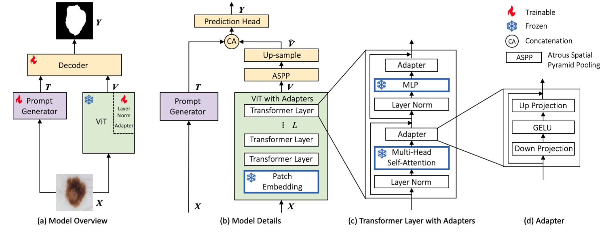

# AViT: Adapting Vision Transformers for Small Skin Lesion Segmentation Datasets

<!--  -->

<p align="center">Architecture of AViT: (a) Model overview with its prompt generator (a shallow CNN network), a large pre-trained ViT backbone with adapters, and a compact decoder. (b)  Model details. (c) Details of a transformer layer with adapters. (d) Details of our adapters. During training, all modules in (b,c,d) contoured with blue borders are frozen, which encompasses 86.3% of AViT's parameters.</p>

This is a PyTorch implementation for [AViT: Adapting Vision Transformers for Small Skin Lesion Segmentation Datasets, MICCAI ISIC Workshop 2023][6].

We also include plenty of comparing models in this repository: SwinUnet, UNETR, UTNet, MedFormer, SwinUNETR, H2Former, FAT-Net, TransFuse, AdaptFormer, and VPT (Please go to the paper to find the detailed information of these models).

If you use this code in your research, please consider citing:

```text
@inproceedings{du2023avit,
  title={{AViT}: Adapting Vision Transformers for Small Skin Lesion Segmentation Datasets},
  author={Du, Siyi and Bayasi, Nourhan and Hamarneh, Ghassan and Garbi, Rafeef},
  booktitle={26th International Conference on Medical Image Computing and Computer Assisted Intervention (MICCAI 2023) ISIC Workshp},
```


## Requirements
This code is implemented using Python 3.8.1, PyTorch v1.8.0, CUDA 11.1 and CuDNN 7.
```sh
conda create -n skinlesion python=3.8
conda activate skinlesion  # activate the environment and install all dependencies
cd MDViT/
conda install pytorch==1.11.0 torchvision==0.12.0 torchaudio==0.11.0 cudatoolkit=11.3 -c pytorch
# or go to https://pytorch.org/get-started/previous-versions/ to find a right command to install pytorch
pip install -r requirements.txt
```

## Data
### Data Preparation

* [ISIC 2018 (ISIC)][1]
* [Dermofit Image Library (DMF)][2]
* [Skin Cancer Detection][3]
* [PH2][4]

### Preprocessing

1. Please run the following command to resize original images into the same dimension (512,512) and then convert and store them as .npy files.
```sh
python Datasets/process_resize.py
```

2. Use [Datasets/create_meta.ipynb][5] to create the csv files for each dataset.


## Pretrained Model
* [DeiT][7]
* [ViT][8]
* [Swin Transformer][9]
* [ResNet][10]
You can also use [timm][11] python package to get the pretrained weights of DeiT, ViT, and Swin Transformer and [Torchvision][12] python package to get the pretrained weights of ResNet.

## Training and Evaluating
1. AViT
```sh
# ViTSeg_CNNprompt_adapt, SwinSeg_CNNprompt_adapt, DeiTSeg_CNNprompt_adapt
python -u multi_train_adapt.py --exp_name test --config_yml Configs/multi_train_local.yml --model ViTSeg_CNNprompt_adapt --batch_size 16 --adapt_method MLP --num_domains 1 --dataset isic2018 --k_fold 0
```

2. BASE
```sh
# ViTSeg, SwinSeg, DeiTSeg
python -u multi_train_adapt.py --exp_name test --config_yml Configs/multi_train_local.yml --model ViTSeg --batch_size 16 --adapt_method False --num_domains 1 --dataset isic2018 --k_fold 0
```

3. Other skin lesion segmentation models
```sh
# SwinUnet, UNETR, UTNet, MedFormer, SwinUNETR, H2Former, FAT-Net, TransFuse
python -u multi_train_adapt.py --exp_name test --config_yml Configs/multi_train_local.yml --model FATNET --batch_size 16 --dataset isic2018 --k_fold 0
```
Please refer to [this repository][13] to run BAT.

3. AdaptFormer and VPT
```sh
# AdaptFormer
python -u multi_train_adapt.py --exp_name test --config_yml Configs/multi_train_local.yml --model AdaptFormer --batch_size 16 --adapt_method AdaptFormer --num_domains 1 --dataset isic2018 --k_fold 0
# VPT
python -u multi_train_adapt.py --exp_name test --config_yml Configs/multi_train_local.yml --model VPT --batch_size 16 --adapt_method False --num_domains 1 --dataset isic2018 --k_fold 0
```

## Model Weights
We release the weights for AViT on ViT-Base.

| Dataset | ISIC | DMF | SCD | PH2 |
|----------|----------|----------|----------| 
|   Weights  |   [14]  |   [15]  |  [16] | [17] |


[1]: https://challenge.isic-archive.com/data/#2018
[2]: https://licensing.edinburgh-innovations.ed.ac.uk/product/dermofit-image-library
[3]: https://uwaterloo.ca/vision-image-processing-lab/research-demos/skin-cancer-detection
[4]: https://www.fc.up.pt/addi/ph2%20database.html
[5]: https://github.com/siyi-wind/AViT/blob/main/Datasets/create_meta.ipynb
[6]: https://arxiv.org/abs/2307.13897
[7]: https://github.com/facebookresearch/deit
[8]: https://github.com/google-research/vision_transformer
[9]: https://github.com/microsoft/Swin-Transformer
[10]: https://download.pytorch.org/models/resnet34-333f7ec4.pth
[11]: https://timm.fast.ai/
[12]: https://pytorch.org/vision/stable/models.html
[13]: https://github.com/jcwang123/BA-Transformer
[14]: https://drive.google.com/drive/folders/1ct8_GztVLC5BCWpzGxp9MZKP5ZQk9Cve?usp=sharing
[15]: https://drive.google.com/drive/folders/1Gvs8drboYJdyvn_TerOD5UettA_E0Izi?usp=sharing
[16]: https://drive.google.com/drive/folders/16QL8vVoXlG1hYj29SuZD9Kze41xPvpfu?usp=sharing
[17]: https://drive.google.com/drive/folders/1InVKXuJvWSIdL7H1V6s3cMRMxRLO-36h?usp=sharing
